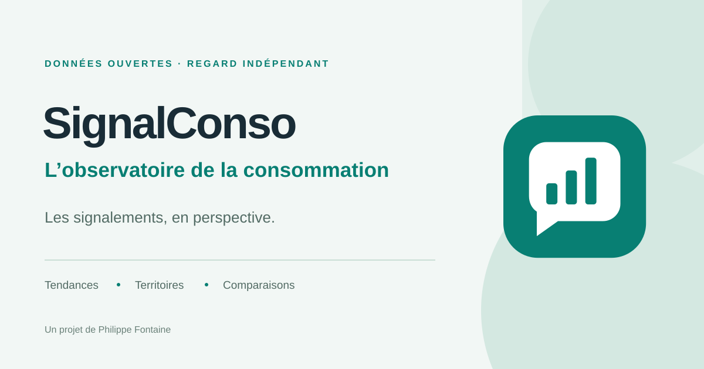

# SignalConso · L’observatoire de la consommation



Une application Shiny indépendante pour explorer les signalements de consommation : tendances, catégories, territoires et comparaison de profils. La refonte propose une interface responsive en français, des filtres communs à toutes les vues et un export CSV compatible Excel.

**Sans source configurée, l’application affiche 18 000 signalements fictifs de 2023 à 2025.** Le mode démonstration est indiqué dans l’interface et dans les exports. Ces chiffres ne décrivent pas l’activité réelle de SignalConso.

## Démarrer en local

Depuis la racine du dépôt, installer les dépendances dans R :

```r
install.packages(c("remotes", "pkgload"))
remotes::install_deps(dependencies = NA)
```

Puis lancer l’application :

```r
shiny::runApp(launch.browser = TRUE)
```

Ou depuis un terminal :

```sh
Rscript -e "shiny::runApp(launch.browser = TRUE)"
```

Aucun fichier `set_cfg.R`, compte S3 ou téléchargement de données n’est nécessaire pour la démonstration. Les packages `arrow` et `aws.s3` sont facultatifs en local et servent uniquement aux sources correspondantes. Le dépôt contient également le manifeste de déploiement Posit Connect ; aucun déploiement n’a été effectué.

## Explorer

- **Vue d’ensemble** : indicateurs, évolution quotidienne, hebdomadaire ou mensuelle, catégories, traitement et rythmes des signalements.
- **Territoires** : carte et classement par région ou département. Les volumes ne sont pas rapportés à la population.
- **Comparaisons** : de deux à cinq groupes, en nombre ou en pourcentage du total de chaque groupe.
- **Données** : tableau consultable et export CSV en UTF-8, avec séparateur point-virgule.

Choisir une période, des catégories et des territoires dans le panneau latéral, puis cliquer sur **Appliquer les filtres**. Les filtres avancés ajoutent départements, sous-catégories, étiquettes et traitement. **Réinitialiser** retrouve le périmètre complet. Le guide de lecture précise le sens et les limites des indicateurs.

L’export comprend tout le périmètre des filtres appliqués ; la recherche textuelle du tableau ne réduit que son affichage.

## Brancher les données réelles

L’application conserve la prise en charge des fichiers SignalConso et d’une source S3, mais nécessite leur configuration explicite. Aucun accès à l’ancien stockage n’est tenté automatiquement.

### Fichier local

Dans R, avant de lancer l’application :

```r
Sys.setenv(SIGNALCONSO_DATA = "/chemin/vers/signalconso.csv")
shiny::runApp()
```

Formats acceptés : CSV, RDS et Parquet. Pour Parquet, installer `arrow` avec `install.packages("arrow")`. Sous Windows, utiliser par exemple `C:/donnees/signalconso.csv`.

Le tableau doit contenir `creationdate` ou `date`. Les dates sont acceptées au format `AAAA-MM-JJ`, avec heure facultative, ou `JJ/MM/AAAA`. Une date absente ou invalide déclenche un message d’erreur.

Les colonnes d’analyse sont `category`, `subcategories`, `tags`, `status`, `dep_code`, `dep_name`, `reg_code`, `reg_name` et `signalement_traitement`. Les colonnes facultatives absentes sont indiquées comme « Non renseigné ». Les indicateurs historiques `signalement_transmis`, `signalement_lu` et `signalement_reponse` sont également pris en charge pour reconstruire le traitement. Les codes de département, dont `01` et `2A`, sont conservés comme texte.

### Objet S3

```r
install.packages(c("aws.s3", "arrow"))
Sys.unsetenv("SIGNALCONSO_DATA")
Sys.setenv(
  SIGNALCONSO_S3_BUCKET = "mon-bucket",
  SIGNALCONSO_S3_OBJECT = "dossier/signalconso.parquet"
)
shiny::runApp()
```

Configurer séparément les identifiants AWS selon le mécanisme habituel de `aws.s3`, sans les inscrire dans le code ni les versionner. L’objet par défaut est `signalconso.parquet` ; les objets CSV et RDS sont également acceptés.

La priorité des sources est : **fichier local → S3 → démonstration**. Une source configurée mais indisponible affiche une erreur et n’est jamais remplacée silencieusement par des données fictives. Pour retrouver la démonstration, retirer `SIGNALCONSO_DATA` et `SIGNALCONSO_S3_BUCKET`, puis relancer l’application.

### Préparer un fichier

```r
pkgload::load_all()
preprocess_data("signalconso.csv", output = "signalconso.rds")
```

Le prétraitement harmonise dates, libellés et codes géographiques, conserve le fichier source et n’envoie rien sur S3. `output` est facultatif : sans ce paramètre, la fonction renvoie simplement le tableau préparé. `maj_data()` permet un téléchargement explicite ; les données sont validées avant le remplacement du fichier destination.

## Déployer sur Posit Connect

Le fichier `manifest.json` décrit les fichiers de l’application et les versions exactes de ses dépendances. Il a été généré avec `rsconnect::writeManifest()`, pour une application Shiny dont le point d’entrée est `app.R`.

Le lanceur charge le package depuis les sources du bundle, puis appelle explicitement son export :

```r
pkgload::load_all(export_all = FALSE, helpers = FALSE, attach_testthat = FALSE)
options(golem.app.prod = TRUE)
getExportedValue("shinySignalConso", "run_app")()
```

L’application n’a donc pas à être installée comme un package externe sur Connect.

Après une modification des fichiers de l’application ou des dépendances, régénérer le manifeste depuis la racine :

```r
install.packages(c("rsconnect", "pkgload", "arrow", "aws.s3"))
source("dev/write_manifest.R", encoding = "UTF-8")
```

```sh
Rscript tests/deployment-checks.R
```

Le manifeste inclut les dépendances Parquet/S3 pour permettre le raccordement des données réelles. Les bibliothèques locales, caches, tests, anciens paramètres de déploiement et fichiers de secrets sont exclus. Le manifeste actuel a été généré sous **R 4.6.1** : vérifier les versions disponibles sur le serveur et, si nécessaire, le régénérer avec la version de R utilisée sur Connect.

Pour un déploiement depuis Git :

1. Commiter et pousser les sources, les ressources et `manifest.json`.
2. Dans Connect, choisir **Publish → Import from Git**, puis sélectionner le dépôt, la branche et le manifeste à la racine.
3. Renseigner le titre ci-dessous. Dans **Settings → General**, ajouter la description et téléverser la vignette.
4. Configurer la source des données dans les variables d’environnement du contenu Connect. Un chemin local doit être accessible **sur le serveur** ; pour S3, utiliser les paramètres `SIGNALCONSO_S3_*` documentés plus haut et les accès AWS autorisés sur le serveur.

Le dépôt ne publie rien automatiquement. Sans configuration de données, Connect affichera le même mode démonstration clairement signalé.

### Titre, description et identité

**Titre :** SignalConso · L’observatoire de la consommation

**Description :** Explorez les signalements de consommation par période, catégorie et territoire. Un observatoire indépendant pour suivre les tendances, comparer les profils et télécharger les données.

- **Logo vectoriel :** [logo.svg](inst/app/www/logo.svg), utilisé dans l’interface et comme favicon.
- **Vignette du catalogue Connect :** [connect-thumbnail.svg](inst/app/www/connect-thumbnail.svg), au format 1200 × 630.
- **Textes de l’application :** `app_title` et `app_description` dans [inst/golem-config.yml](inst/golem-config.yml).

Le logo associe une bulle de dialogue aux barres d’un graphique, dans le vert profond de l’observatoire. Il s’agit de l’identité de ce projet indépendant.

Connect gère le titre, la description et la miniature comme des **paramètres du contenu**, séparément du manifeste. La présence du logo dans le dépôt ne définit pas automatiquement la miniature du catalogue. Voir les [paramètres de contenu Connect](https://docs.posit.co/connect/user/content-settings/) et la [documentation du manifeste](https://rstudio.github.io/rsconnect/reference/writeManifest.html).

## Vérifications

Depuis la racine du dépôt :

```sh
Rscript tests/data-checks.R
Rscript tests/chart-checks.R
Rscript tests/server-checks.R
```

Ces scripts vérifient notamment le chargement, les dates invalides, la stabilité de la démonstration, la conservation des fichiers sources, les agrégations, les pourcentages et les filtres du serveur. Ils ne nécessitent pas de connexion S3.

Projet indépendant de l’administration et du service officiel [SignalConso](https://signal.conso.gouv.fr). Code sous [licence MIT](LICENSE.md). Données réelles : [jeu SignalConso sur data.gouv.fr](https://www.data.gouv.fr/datasets/signalconso).
